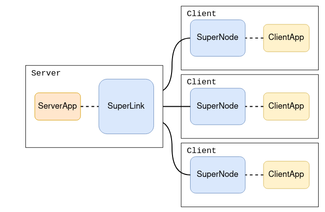

# Membership Inference Attack on Flower

## Install dependencies and project
Use poetry as virtual env and package manager

```bash
poetry env use python3.12
poetry env info
poetry install

wandb login
```

After that login into wandb:
```
wandb login
```

## Explain Configs
### . toml
[pyproject.toml](pyproject.toml)
- provides package manager
- provides flower config
  - describe flower parameter... (explain)

### hydra
[experiments_conf](experiments_conf)
- provides configs for MIA and Flower experiment
- dataclasses provides types for configs (if you want to change a parameter you have to change it in the dataclass too in /[experiments_conf_types](experiments_conf_types))
- For flower experiments configs get injected via CLS in the python run_scripts. If you use hydra directly for flower experiments it will only run in simulations

## Project Structure
### model_checkpoints_target
- Every Flower run saves the target model every 5 rounds in a seperate subfolder in this folder
- MIA uses this folder to load the target model

### dataset_splits
- is created by [split_cifar10_mia.py](flower/utils/split_cifar10_mia.py), is automatically called in the flower server app and mia run script
- the cifar-10 Hugging Face dataset is split into 4 parts (D1=flower_train, D2=flower_test, D3=shadow_train, D4=shadow_test)
- currently: D1=20.000, D2=10.000, D3=15.000, D4=15.000
- D2 comes from the original CIFAR-10 test set, so it is not split further
- D1, D3, D4 come from the original CIFAR-10 train set
- You can change the sizes via the constants in the script, but make sure to remove the dataset_split folder if you change the sizes
- for non-simulated federated runs: Every Client downloads the complete dataset, splits it locally and uses his distribution

### add different target models
- add different target models in [models](flower/models)
- add model to model factory [model_factory.py](flower/utils/model_factory.py)
- now you can use the model in the configs

### custom strategy
- [custom_weighted_fedavg.py](flower/strategies/custom_weighted_fedavg.py)
- overrides the standard FedAvg strategy / server default strategy

## Dataset
- Code uses the cifar-10 dataset from Hugging Face
- Dataset is converted to PyTorch tensors
- You can change the dataset: 
  - make sure to change the model & model factory
  - mia config pass the classnames (should also work with classnames: None)
  - delete dataset_splits folder

## Run with cpu or gpu
- change in [base.yaml](experiments_conf/flower/base.yaml) and [base.yaml](experiments_conf/mia/base.yaml) device to cuda or cpu
- You have to change the parameter in flower/base.yaml, because you have to set the client-resources for flower

## metrics folder
all metrics from flower and mia runs are saved in the metrics folder as json files
also saved to wandb

## MIA 
- You can run the MIA directly without a federated learning run: 
```
python3 run_mia_experiment.py
```
- it uses the [base.yaml](experiments_conf/mia/base.yaml) config with the [example FL target model checkpoint](model_checkpoints_target/example) (10 server rounds, 10 epochs, IID data)


- or run a specific config like this:
```
python3 run_mia_experiment.py mia=run1
```

## FLOWER
note: firstly build with version 1.14.0 and then updated to 1.22.0
- no errors or warnings with 1.22.0 but maybe the code looks different to the tutorials

! default device=gpu if you want to use only cpu (change [base.yaml](experiments_conf/flower/base.yaml) device->cpu)
flower model is saved every 5th round to the folder [model_checkpoints_target](model_checkpoints_target)
```
python3 run_flower_experiment.py flower=run1
```


## Run with the Simulation Engine

In the `my-awesome-app` directory, use `flwr run` to run a local simulation:

```bash
flwr run .
```


Refer to the [How to Run Simulations](https://flower.ai/docs/framework/how-to-run-simulations.html) guide in the documentation for advice on how to optimize your simulations.

## Run with the Deployment Engine

setup:
- git clone
- use poetry as package manager with python 3.10
  - poetry install
- run simulation (with 10 client nodes)
  - flwr run .
- first run -> wandb login: API-key

dataset: https://huggingface.co/datasets/uoft-cs/cifar10
- 10 classes (airplane, automobile, bird, cat, deer, dog, frog, horse, ship, truck)
- trainset of 50k images (80% train, 20% test) (5k images from each class)
- testset of 10k images 
- 32x32 pixels, 3 channels(rgb)
- size: 144MB

cluster:
- 10 clients (super nodes)
- num-server-rounds = 5 (get slitted on all cpu cores)
- fraction-fit = 0.5
- local-epochs = 1
- explain:
  - serverApp: client selection, client configuration, result aggregation (short lived process)
  - SuperLink: forwards task instructions to clients (SuperNodes) and receives task results back 
  - SuperNode: hold data, asks for tasks, executes tasks(training), and sends results back to the server 
  - ClientApp: local model training and evaluation, pre- and post-processing (short lived process)
  - (network communication is taken care of by Flower: SuperLink, SuperNode)



change dataset: (in task)
- choose huggingface dataset: dataset="uoft-cs/cifar10",
- check the column names in hugging face: batch["img"] or batch["image"]
- check if dataset is greyscale or rgb: -> change Net and Compose(ToTensor(), Normalize((0.5 or 0.5,0.5,0.5), ...)
- check size of dataset -> change Net

Changes:
 - dataset: "uoft-cs/cifar10"
 - partitioner: non-iid (DirichletPartitioner with alpha 0.5)

callbacks: (in Strategy FedAvg, serverApp)
- how to aggregate metrics sent back from the clients app into strategy (weighted_average)
  (it is also possible to evaluate the model globally/centralized on the server app if there is a global evaluation dataset)
- learning decreases with higher round number (perform fit method in a different way)
- centralized evaluation on the server app after each global model aggregation round 

costume strategy: (global model aggregation)
- add pytorch model checkpoints for each round 
- push metrics to wandb (weights and biases) for each round 
- create json file to store metrics


what i could do better but won t:
- add more attack Attack Model Diversity for  more black box(CatBoost, XGBoost, Logistic Regression)
- Use logits, loss values, or gradient norms (if white-box is permitted)
- Implement top-k probability truncation to simulate black-box API constraints.


Helps against overfitting -> no testing:
- Model Calibration: temperature scaling to flatten softmax probabilities

Run:
with GPU: (change in toml device parameter)
```bash
flwr run . local-simulation-gpu
```
with CPU: (change in toml device parameter)
```bash
flwr run . 
```


explain flower build: especially for non-simulation runs (with real clients)
- flwr run . -> automatically builds the package .fab and installs it in a virtual env -> runtime erros after long run (corrupted files)

Difference to Shokri:
 - Attack Model Type RandomForestClassifier instead of small MLP
 - number of Shadow Models: 4+ instead of 1
 - extra features
 - Balanced Member/Non-Member Training (not done in Shokri)
 - shadow model datasets are the same size as the target model’s training set
    - currently only if 1 shadow model is used
    - testset should also be the same size as the target model’s training set (splitted)
 -  code currently implements one attack model per class across all shadow models, not per shadow model per class
  improved versions of MIA from later papers (like Salem et al. 2018 or Yeom et al. 2018) where fewer shadow models are used or models are shared.


run mia with different configs:
```
python shadow_models_central_per_class_true_shokri.py -m --config-name=mia_run1
```

Run first time setup:
```
wandb login
```

Flower run different configs:
```
flwr run . --run-config 'num-server-rounds=1 local-epochs=1'
```


make sure to init with target model you want to attack (all target models are in the folder ./model_checkpoints_target)
```
python3 run_mia_experiment.py mia=run1
```

! default with gpu if you want to use only cpu (change [base.yaml](experiments_conf/flower/base.yaml) device=cpu)
flower model is saved every 5th round to the folder  ./model_checkpoints_target
```
python3 run_flower_experiment.py flower=run1
```

explain hpc logging:
- for every mia.sbatch all logs from all runs in one folder  -> mia_${SLURM_JOB_ID} (all runs) + mia_%A_%a.out every single run in top folder 
- for every flower.sbatch all flower runs in one folder -> flower_${SLURM_JOB_ID} + flower_%j.out /.err (everything from all runs is written there)
- → logs alle in einen folder → nur umgehbar mit sh script das folder erstellt und dann output festlegt


real federated run:
- run one flower run and then one mia run or run first all flowers rund and then all mia runs?
- wandb init on server
- data split creation (Split in script verteilen an clients oder script einfach auf jeden client laufen lassen)
- pyproject anpassen package (non simulation) + federation anpassen ohne supernodes
- Script schreiben (Setup auf jedem Node, run all tests)
- alle localen daten downloaden (jsons, checkpoints)


///////////
TODO later:
- local simulation explain how checkpoints are saved and used. Folder, delete before run or change (not good, but worked)
    -> use run-name as safe folder for checkpoints -> what if run-name exists? -> cannot add timestamp -> no static filename for mia to load 
    -> also rewrite experiments creation scripts

- later rename data label -> original label in german because in wandb set the data label as diagram axis names

-Only using cpu:
    warnings:
    UserWarning: 'pin_memory' argument is set as true but no accelerator is found, then device pinned memory won't be used.
    warnings.warn(warn_msg)

- wandb warning: (also surpressed some warnings with a method)
    wandb: WARNING `start_method` is deprecated and will be removed in a future version of wandb. This setting is currently non-functional and safely ignored.
